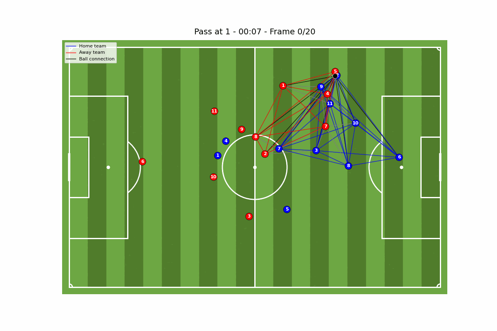

# SoccerNet Visualizer


A Python tool for visualizing tracking soccer data with graph-based tactical analysis. This aims to create realistic visualizations of player movements, ball trajectories and tactical formations using graph theory.





## Features

- Field Rendering
- Player & Ball Tracking
- Graph Analysis
- Animations
- Customizable

The tool is developed to help visualize tracking dataset that has player & ball positions over time. It is also equipped with visualization of various graph connections. It is aimed to be a simple plug-and-play sort of tool. So there is a [config.yaml](config.yaml) file which can be altered easily.

The data currently is expected to be in the pkl format with top level keys:

```python
{
    "windows": [
        {
            "features": np.array,  # Shape: (frames, objects, features)
            "label": str,          # Event type: "Pass", "No-pass", etc.
            "game_time": str,      # e.g., "1 - 23:45"
            # ... other metadata
        }
    ]
}
```

For reference, we have provided the data [here](https://drive.google.com/drive/u/2/folders/1nwGRzsB_ikVvClJOxfQju1CvoCHYT4FO). You need to download it and place it inside ```tracking_data/data``` directory.

## Usage

```bash
python test.py
```

-------------------------------------

## Contributing

Pull requests are welcome. If you find bugs or want to add features, feel free to fork the repo and open an issue or reach out to karkidrishya1@gmail.com | drishya.karki@kaust.edu.sa

