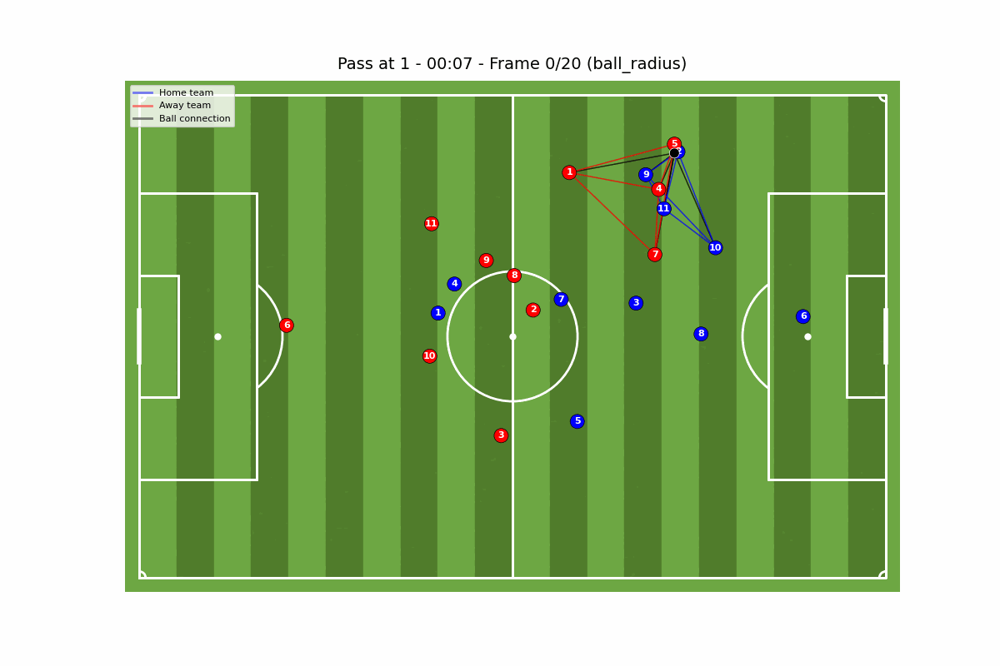
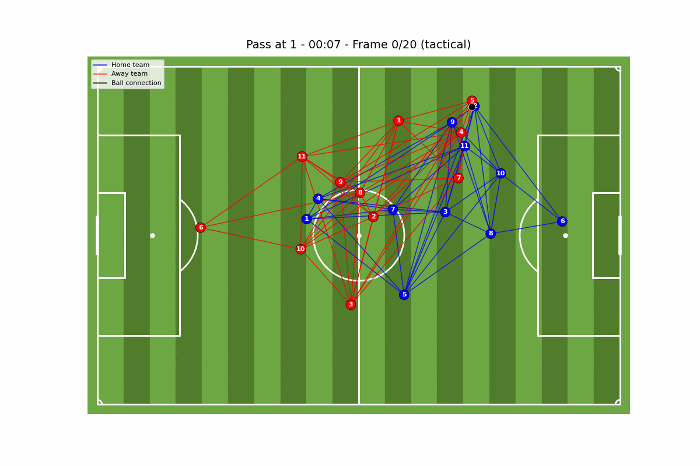

# SoccerNet Visualizer


A comprehensive Python tool for visualizing soccer tracking data with advanced graph-based tactical analysis. Create realistic, interactive visualizations of player movements, ball trajectories, and tactical formations using graph theory and spatial analysis.




## ✨Features

- Field Rendering
- Player & Ball Tracking
- Graph Analysis
- Animations
- Customizable

The tool is developed to help visualize tracking dataset that has player & ball positions over time. It is also equipped with visualization of various graph connections. It is aimed to be a simple plug-and-play sort of tool. So there is a [config.yaml](config.yaml) file which can be altered easily.

## 📁 Data Format

### Expected Structure

```python
{
    "windows": [
        {
            "features": np.array,     # Shape: (frames, objects, features)
            "label": "Pass",          # Event type: "Pass", "Shot", "Foul", etc.
            "game_time": "1 - 23:45", # Match time in format "half - mm:ss"
            "event_id": "unique_id"   # Unique event identifier
        }
    ]
}
```

### Feature Vector Format

Each object in a frame has a feature vector where:

| Index | Description | Range/Values | Required |
|-------|-------------|--------------|----------|
| 0-1 | x, y coordinates | [-52.5, 52.5], [-34, 34] | ✅ |
| 2 | Ball indicator | 1.0 if ball, 0.0 otherwise | ✅ |
| 3 | Home team indicator | 1.0 if home player | ✅ |
| 4 | Away team indicator | 1.0 if away player | ✅ |
| 5-7 | Additional features | Velocity, acceleration, etc. | ❌ |
| 8+ | Position encoding | One-hot player positions | For tactical graphs |

**Coordinate System**: The tool expects coordinates in a centered coordinate system where the center of the pitch is (0,0). Standard FIFA pitch dimensions (105m x 68m) are automatically handled.

For reference, we have provided the data [here](https://drive.google.com/drive/u/2/folders/1nwGRzsB_ikVvClJOxfQju1CvoCHYT4FO). Download the sample dataset and place it in the `tracking_data/data/` directory.


## 🚀 Quick Start

### Prerequisites

```bash
# Required packages
pip install matplotlib numpy scipy torch torch-geometric pyyaml pathlib
```

## Usage

```python
from tracking_data.visualizer import SoccerNetVisualizer

# Initialize and load data
viz = SoccerNetVisualizer(config_path="config.yaml")
viz.load_data("tracking_data/data/test_windows.pkl")

# Visualize a passing event
viz.select_event("Pass", index=0)
viz.visualize_frame(10)  # Show frame 10

# Create an animated GIF
viz.create_animation(graph_type="ball_knn")
```

## 📊 Graph Types Guide

### Ball-Centric Analysis

#### `ball_knn` - K-Nearest Neighbors from Ball with parameter k

```python
viz.visualize_frame(15, graph_type="ball_knn", graph_params={"k": 5})
```

#### `ball_radius` - Connect ball to all players within specified radius

```python
viz.visualize_frame(15, graph_type="ball_radius", graph_params={"radius": 15.0})
```

### Spatial Relationship Analysis

#### `knn_spatial` - K-Nearest Neighbors (Spatial)
- **Purpose**: Connect each player to k nearest neighbors based on position

#### `radius_spatial` - Radius-Based Connections (Spatial)
- **Purpose**: Connect players within specified distance

_Note: There were some performances differences when players where connected based on their xy-coordinates and when they were connected based on their full features. So to analyse that we inspected knn_full and radius_full. Nothing fancy there!_  

#### `fc` - Fully Connected
- **Purpose**: Every player from the same team connected to every other player

### Advanced Analysis

#### `tactical` - Tactical Formation Analysis
- **Purpose**: Connect players based on tactical roles (GK-DEF-MID-ATT)




### Advanced Customization

```python
# Custom visualization
viz = SoccerNetVisualizer("custom_config.yaml")

# Override config programmatically
viz.config['graph']['type'] = 'tactical'
viz.config['visualization']['players']['home_color'] = '#FF0000'

# Chain operations
viz.load_data("data.pkl").select_event("Shot", index=2).create_animation()
```

## 📚 Common Use Cases

### Analyzing Goal Sequences

```python
# Load match data
viz = SoccerNetVisualizer()
viz.load_data("match_data.pkl")

# Find and analyze all shots
events = viz.get_available_events()
shot_events = [e for e in events['default'] if 'Pass' in e]

for i, event_type in enumerate(shot_events):
    viz.select_event(event_type, index=0)
    viz.create_animation(
        graph_type="ball_radius",
        save_path=f"goal_sequence_{i}.gif"
    )
```

### Comparing Graph Types

```python
# Analyze same event with different graph perspectives
viz.select_event("Pass", index=5)

graph_types = ["ball_knn", "tactical", "knn_spatial"]
for graph_type in graph_types:
    viz.visualize_frame(15, graph_type=graph_type, show=True)
    viz.create_animation(
        graph_type=graph_type,
        save_path=f"pass_analysis_{graph_type}.gif"
    )
```

## 🔧 Extending the Tool

### Adding New Data Formats

```python
from data_reader import DataReader

class CSVDataReader(DataReader):
    def load_data(self, file_path):
        # Implement CSV loading logic
        # Return standardized EventData objects
        pass
    
    def get_available_events(self, data):
        # Return available event types
        pass

# Register in factory
from data_reader import DataReaderFactory
DataReaderFactory.readers['.csv'] = CSVDataReader
```

### Custom Graph Types

```python
from graph import SoccerGraph

class CustomGraph(SoccerGraph):
    def build_custom_graph(self, features, **params):
        # Implement custom graph logic
        # Must set self.data with torch_geometric.data.Data
        pass

# Use in visualization
viz.visualize_frame(10, graph_type="custom", graph_params={"param": "value"})
```

## 📖 API Reference

### Core Classes

#### `SoccerNetVisualizer`
Main visualization class for orchestrating the entire pipeline.

```python
viz = SoccerNetVisualizer(config_path="config.yaml")
```

**Methods:**
- `load_data(file_path)` - Load tracking data
- `select_event(event_type, split='default', index=0)` - Select event for visualization
- `visualize_frame(frame, graph_type=None, show=True)` - Visualize single frame
- `create_animation(graph_type=None, save_path=None)` - Create animated GIF
- `get_available_events()` - Get all available event types

#### `SoccerGraph`
Graph construction and analysis for spatial relationships.

**Methods:**
- `build_ball_knn_graph(players, ball, frame, k=8)` - Ball-centric KNN
- `build_distance_based_graph(players, ball, frame, distance_threshold=20.0)` - Distance-based
- `build_tactical_graph(features)` - Tactical formation analysis
- `build_knn_pyg(features, k=8)` - PyTorch Geometric KNN
- `build_fc_graph(features)` - Fully connected graph

#### `Field`
Soccer field rendering with realistic appearance.

#### `Player` / `Ball`
Moving objects with position tracking and visualization.


## 📞 Contributing

We welcome contributions! Here's how you can help:

### Reporting Bugs
- Use the issue tracker
- Include system information and error messages
- Provide minimal reproducible examples

### Feature Requests
- Describe the use case and expected behavior
- Consider implementing and submitting a pull request

## 📧 Contact

**Drishya Karki**
- Email: karkidrishya1@gmail.com
- Academic: drishya.karki@kaust.edu.sa

---
